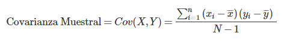
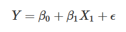

---
output:
  html_document: default
  pdf_document: default
  word_document: default
---

<!-- settings -->
```{r setup, include=FALSE}
knitr::opts_chunk$set(echo = TRUE, warning = FALSE)
```

```{r echo=FALSE}
col_caece <- c(rgb(14/255, 106/255, 115/255, 1))  # Verde "CAECE"
```


<!-- recursos -->
[logo caece]: recursos/logo caece.png
[logo r]: recursos/logo r.png
[logo stats]: recursos/logo stats.png


## [Universidad CAECE](http://www.ucaece.edu.ar/)
![][logo caece]
</br>

## Taller de Lenguajes I
</br>

###### Profesora
#### Silvia A. Cobialca
</br>

###### Informe por
#### Andrés Garcia Alves (leg. 1033744)
</br>

> El objetivo de la materia es el aprendizaje por parte del alumno del Lenguaje R, y su utilización en el análisis estadístido de datos.  

</br>

## Indice
</br>

#### Capítulo 1: Investigación
En la primera parte se investigan conceptos tanto de programación en R, como de Estadística.  
Estos se aplicarán en la 2da parte del informe a un proyecto concreto.
</br></br>

#### Capítulo 2: Análisis de los Datos
En la segunda parte se realiza un análisis estadístico sobre muestras de nivel de Ph, unidas estas a datos climáticos.  
Se aplica regresión lineal para intentar determinar posibles asociaciones entre estos.
</br></br>

#### Anexo 1: Script Datos del Clima (SMN)
Se presenta aquí un script para parsear datos en crudo del clima, disponibles en formato TXT desde la web del Servicio Meteorológico Nacional.
</br></br>

#### Anexo 2: Script Datos de pH
Se presenta aquí un script para parsear datos en crudo de las mediciones de pH, disponibles en formato CSV.
</br></br>

#### Anexo 3: Proceso de Medición de pH
Se presenta aquí una pequeña investigación sobre el proceso de medición del pH y cómo funciona un pH-metro.
</br></br>

#### Historial de Versiones
Detalle de avances del presente informe.
</br></br>
</br></br>


## Capítulo 1: Investigación
</br>

![][logo r] **Markdown**

Markdown es un lenguaje de marcado ligero creado por John Gruber en el año 2004 que trata de conseguir la máxima legibilidad y facilidad de publicación, tanto en su forma de entrada como de salida, inspirándose en muchas convenciones existentes para marcar mensajes de correo electrónico usando texto plano.
[[Wikipedia: Markdown](https://es.wikipedia.org/wiki/Markdown)]  


Saltos de línea: Los saltos de línea se generan cuando se encuentran dos espacios juntos.
```
"Este es un texto,  
separado en dos líneas"
```

Encabezados: Los encabezados se generan cuando se encuentra una almohadilla antes de texto.
```
# Encabezado h1 
## Encabezado h2
### Encabezado h3
#### Encabezado h4
##### Encabezado h5
###### Encabezado h6
``` 

Citas: Para citar solo es necesario escribir una cuña antes del texto.
```
> "Hay una fuerza motriz más poderosa que el vapor, la electricidad y la energía atómica: la voluntad". -Albert Einstein
``` 

Texto con énfasis: envolver entre un asterisco para cursiva y dos para negrita.
``` 
*énfasis* (cursiva)
**énfasis fuerte** (negrita)
```  

Subíndices: envolver entre '~'.  
```H~2~O```  >>  H~2~O

Superíndices: envolver entre '^' para superíndice.  
```2^3^=8```  >>  2^3^=8

Código: Se utiliza el acento grave para identificar código, y corchetes para identificar el lenguaje de programación.
```
ˋˋˋ
Código en 
varias líneas
ˋˋˋ
```

Listas:
``` 
* Un elemento en una lista no ordenada
* Otro elemento en una lista
``` 
```
1. Elemento en una lista enumerada u ordenada.
2. Otro elemento
``` 

Enlaces:
``` 
[Google](http://www.google.com.ar "Título del enlace")
```

Imágenes:
``` 


``` 

Letras Griegas:  
Rodear su nombre de la siguiente forma ```$\mu$``` --> $\mu$, ```$\pi$``` --> $\pi$.
</br></br></br>

![][logo r] **Tipos de Objetos**

La siguiente tabla resume los tipos de objetos y los datos que representan:

Objeto      | Tipos                                 | Puede Mezclar Tipos?
------------|-------------------------------------- | -------------------
vector      | numérico, caracter, complejo o lógico | No
arreglo     | numérico, caracter, complejo o lógico | No
matriz      | numérico, caracter, complejo o lógico | No
factor      | numérico o caracter                   | No
data.frame  | numérico, caracter, complejo o lógico | Si
ts          | numérico, caracter, complejo o lógico | Si
lista       | numérico, caracter, complejo o lógico | Si

Un 'vector' es una variable en el significado comunmente asumido. Un 'factor' es una variable categórica. Un arreglo es una tabla de dimensión *k*, y una 'matriz' es un caso particular de un arreglo donde *k*=2. Notar que los elementos en un arreglo o una matriz son del mismo tipo. Un 'data.frame' es una tabla compuesta de uno o más vectores y/o factores de la misma longitud pero que pueden ser de diferentes tipos. Un ’ts’ es una serie temporal y como talcontiene atributos adicionales tales como frecuencia y fechas. Finalmente, una 'lista' puede contenercualquier tipo de objeto incluyendo otras listas.
[[CRAN, \'R para Principiantes\', E. Paradis](https://cran.r-project.org/doc/contrib/rdebuts_es.pdf)]
</br></br></br>

![][logo r] **Vectores**

Se le denomina vector, formación o arreglo (en inglés array) a una zona de almacenamiento contiguo que contiene una serie de elementos del mismo tipo.
[[Wikipedia: Vector](https://es.wikipedia.org/wiki/Vector_(informática))]  

En específico a R, un vector es una esctructura que representa una **secuencia de datos** del mismo tipo, identificados por un subíndice con base en uno.
</br></br>

```{r}
# creación de vectores con rangos numéricos
vector1 <- c(1:3)      # 1:3 es un rango de núm. enteros del 1 al 3
vector2 <- c(4:6)      # 4:6 es un rango de núm. enteros del 4 al 6
vector3 <- c(7:9)      # 1:3 es un rango de núm. enteros del 7 al 9
```


```{r cache=TRUE}
vector1               # contenido del vector1
vector1[2]            # 2do elemento del vector1
```
</br></br>

![][logo r] **Data Frame**

Un data frames es un estructura de datos de dos dimensiones (tablas).

Estos están compuestos por **observaciones** (representados en las filas), y **variables** que son medidas sobre estos (representadas en las columnas).

Para más información, véase 
[[R Tutorial](https://www.tutorialspoint.com/r/r_data_frames.htm)], o 
[[R para principiantes](https://bookdown.org/jboscomendoza/r-principiantes4/data-frames.html)].  

R provee un amplio conjunto de dataframes por default a fines didácticos. Los mismos se pueden acceder en *datasets::nombre-del-dataframe*, o en forma abreviada simplemente con *nombre-del-dataframe*.
</br></br>

```{r cache=TRUE}
# construcción de un data.frame con los vectores de la sección anterior
data.frame(vector1, vector2, vector3)
```
</br>

```{r cache=TRUE}
# visualizar el dataframe datasets::mtcars
mtcars
```
</br>

Para referenciar a una variable dada del dataframe se utiliza el caracater '\$', quedando entonces de la siguiente forma: *nombre-del-dataframe$nombre-de-la-variable*

```{r cache=TRUE}
mtcars$mpg
```
</br></br>

![][logo stats] **Promedio**

También conocido como **media aritmética**, es el valor característico de una serie de datos cuantitativos.
[[Wikipedia: Media Aritmética](https://es.wikipedia.org/wiki/Media_aritmetica)]  
Se representa con la letra griega Mu '$\mu$'.

Para calcular el promedio se utiliza ```mean(x)``` sobre una secuencia numérica.

```{r cache=TRUE}
mean(mtcars$mpg)      # promedio
```
</br></br>

![][logo stats] **Desviación Estándar**

Es la medida de la variación o **dispersión** de un conjunto de datos numérico.
[[Wikipedia: Desviación Típica](https://es.wikipedia.org/wiki/Desviacion_tipica)]  
Se representa con la letra griega Sigma '$\sigma$'.

Para calcular la desviación estándar se utiliza ```sd(x)``` sobre una secuencia numérica.

```{r cache=TRUE}
sd(mtcars$mpg)        # desviacion estandar
```
</br></br>

![][logo stats] **Histograma**

Es la representación gráfica de una variable en forma de barras.
[[Wikipedia: Histograma](https://es.wikipedia.org/wiki/Histograma)]  

Para visualizar un histograma se utilizará ```hist(x, ...)```  
Se puede elegir la cantidad de separaciones deseadas (en cuartiles, deciles, percentiles, etc) a través del 2do parámetro.  

```{r cache=TRUE}
hist(mtcars$carb, 10, col=col_caece)  # histograma en deciles
```

De la gráfica se pueden realizar algunas observaciones:

- La frecuencia máxima de aparición es 10 veces, observada en los valores 2 y 4.
- Casi todas las mediciones se situan en el rango de valores 1 al 4.
</br></br></br>

![][logo stats] **Diagrama de Dispersión**

Un diagrama de Dispersiónes un tipo de diagrama matemático, que utiliza las coordenadas cartesianas para mostrar los valores de dos variables para un conjunto de datos.
[[Wikipedia: Diagrama de Dispersión](https://es.wikipedia.org/wiki/Diagrama_de_dispersión)]  

Se generar un diagrama de dispersión se utilza ```pairs(x)```.

```{r cache=TRUE, fig.width=9}
pairs(mtcars)         # diagrama de dispersión
```
</br></br>

![][logo r] **Estructura**

Se puede visualizar la **estructrura** de cualquier objeto mediante la función ```str(x)```.
</br></br>

```{r cache=TRUE}
str(mtcars)           # e(STR)uctura del dataframe mtcars
```

- En la primera línea indica que ese objeto es del tipo 'data.frame', con 32 observaciones, con 11 variables en cada una.
- En las filas sucesivas muestra los primeros 10 valores y su tipo de dato para cada una de las variables del dataframe.
</br></br></br>

![][logo r] **Sumario**

Se puede visualizar un **resumen** de cualquier objeto mediante la funcion ```summary(x)```
</br></br>

```{r cache=TRUE}
summary(mtcars$carb)  # sumario de mtcars$carb
```

Donde para este dataframe$variable arroja que:

- El valor mínimo es 1.
- El valor máximo es 8.
- La mediana es 2.
- El promedio es 2,812.
- El Cuartil #1 termina en 2.
- El Cuartil #3 termina en 4.
</br></br></br>

![][logo r] **Primeros & Ultimos**

Se pueden visualizar tanto las **n primeras**, como **n últimas** observaciones de un dataframe mediantes el uso de las funciones ```head(x)``` y ```tail(x)```, respectivamente.  
Por default se incluirán hasta 6 elementos, pero se puede modificar este comportamiento mediante el 2do parámetro.
</br></br>

```{r cache=TRUE}
head(mtcars)          # primeras 6 observaciones
tail(mtcars, 10)      # últimas 10 observaciones
```
</br></br>

![][logo stats] **Valores Atípicos (Outliers)**

Es una observación que es numéricamente distante del resto de los datos. Las estadísticas derivadas de los conjuntos de datos que incluyen valores atípicos serán frecuentemente engañosas.
[[Wikipedia: Valor Atípico](https://es.wikipedia.org/wiki/Valor_atipico)]  

En otras palabras, los valores atípicos en los datos pueden distorsionar las predicciones y afectar la precisión.
Estos deberían ser descartados previo a relizar cualquier análisis.
</br></br></br>

![][logo stats] **Diagrama de Caja (Box-Plot)**

Es un método estandarizado para representar gráficamente una serie de datos numéricos a través de sus cuartiles.
[[Wikipedia: Diagrama de Caja](https://es.wikipedia.org/wiki/Diagrama_de_caja)]  

Se utiliza para la detección de Valores Atípicos, presentados en este gráfico como pequeños círculos en los extremos.

- Cuartil #1: desde la línea superior del gráfico hasta el inicio de la caja.
- Cuartil #2: desde el inicio de la caja hasta la línea del medio de la caja (la mediana).
- Cuartil #3: desde la línea del medio de la caja hasta el fin de la caja.
- Cuartil #4: desde el fin de la caja hasta la línea inferior del gráfico.
</br></br>

```{r cache=TRUE}
par(mar=c(2,2,2,2))
boxplot(mtcars$hp, col=col_caece)  # distribucuión en cuartiles
```

En el margen superior de la gráfica se puede visualizar como el dataframe *mtcars*, sobre su variable *$hp*, incluye una observación que presenta un valor atípico.
</br></br>

```{r cache=TRUE}
par(mar=c(2,2,2,2))
boxplot(mtcars, col=col_caece)
```

De la gráfica anterior se observa que en general no se pueden comparar de forma directa las variables de un dataframe debido a las diferencias de escala. Previo a su comparación se requiere normalizar los datos (ver siguiente sección).
</br></br></br>

![][logo stats] **Normalización de Datos**

La normalización de índices es el proceso de ajustar los valores medidos en diferentes escalas respecto a una **escala común**. [[Wikipedia: Normalización](https://es.wikipedia.org/wiki/Normalización_(estadística))]  

Si bien existen varios procesos, la normalización estándar viene dada por la fórmula:


Es decir, cada observación 'X' menos la media '$\mu$', dividido sobre la desviación estandar '$\sigma$'.  

Combinando las funciones vistas hasta el momento, en unas pocas líneas de código se pueden normalizar algunas variables:

```{r cache=TRUE}
# en este ejemplo se normalizarán las variables 'mtcars$hp' y 'mtcars$wt'

mu = mean(mtcars$hp)                    # promedio de mtcars$hp
sigma = sd(mtcars$hp)                   # desviación estandar de mtcars$hp
normal_hp = (mtcars$hp - mu) / sigma    # normalizacion de mtcars$hp

mu = mean(mtcars$wt)                    # promedio de mtcars$wt
sigma = sd(mtcars$wt)                   # desviación estandar de mtcars$wt
normal_wt = (mtcars$wt - mu) / sigma    # normalizacion de mtcars$wt

# construcción de un nuevo dataframe con ambas variables ya normalizadas
datos <- data.frame(normal_hp, normal_wt)
datos                                   # visualizar el dataframe
```

Y ahora ya se puede proceder a compararlas:

```{r cache=TRUE}
par(mar=c(2,2,2,2))
boxplot(datos, col=col_caece)
```
</br></br></br>

![][logo stats] **Normalización de Datos, Parte II**

Sabiendo ya el proceso de normalización "a mano", es importante conocer que se le puede pedir a R que lo realice por nosotros, ya sea tanto sobre una variable, como sobre un dataframe completo.


Para realizar la normalización se debe utilizar la función ```scale(x)```.

```{r cache=TRUE}
par(mar=c(2,2,2,2))
normal_hp <- scale(mtcars$hp)
normal_wt <- scale(mtcars$wt)
datos <- data.frame(normal_hp, normal_wt)
boxplot(datos, col=col_caece)
```

Ahora normalizando el dataframe completo:

```{r cache=TRUE}
par(mar=c(2,2,2,2))
datos <- scale(mtcars)
boxplot(datos, col=col_caece)
```

</br></br></br>

![][logo r] **Importación de Datos**

Una forma sencilla de importar datos en R es a través de la clase ```read.<formato>(path)```.
</br></br>

```{r cache=TRUE}
read.csv(file="recursos/test.csv", header=TRUE)
```
</br></br>

![][logo stats] **Desnormalización de Datos**

La desnormalización de datos no es más que aplicar la formula de la normalización a la inversa.

Es decir, cada observación normalizada 'X~n~' multiplicado por la desviación estandar '$\sigma$', más la media '$\mu$'.  

```{r cache=TRUE}
mu = mean(mtcars$hp)                    # promedio de mtcars$hp
sigma = sd(mtcars$hp)                   # desviación estandar de mtcars$hp

normal_hp = (mtcars$hp - mu) / sigma    # normalización
de_normal_hp = (normal_hp * sigma) + mu # desnormalización
```

```{r cache=TRUE}
mtcars$hp                               # los valores originales
normal_hp                               # los valores nomalizados
de_normal_hp                            # los valores desnormalizados
```
</br></br>

![][logo stats] **Correlación Lineal, Parte I: Teoría**

Para estudiar la relación lineal existente entre dos variables continuas es necesario disponer de parámetros que permitan cuantificar dicha relación. Uno de estos parámetros es la covarianza, que indica el grado de variación conjunta de dos variables aleatorias.  
[[R Pubs: Correlación lineal y Regresión lineal simple](https://rpubs.com/Joaquin_AR/223351)]

Definición:  


siendo 
<math xmlns="http://www.w3.org/1998/Math/MathML">
  <mover><mi>x</mi><mo accent="false">&#x00AF;<!-- ¯ --></mo></mover>
</math>
 e y 
<math xmlns="http://www.w3.org/1998/Math/MathML">
  <mover><mi>y</mi><mo accent="false">&#x00AF;<!-- ¯ --></mo></mover>
</math>
la media de cada variable y x~i~ e y~i~ el valor de las variables para la observación i.

La covarianza depende de las escalas en que se miden las variables estudiadas, por lo tanto, no es comparable entre distintos pares de variables. Para poder hacer comparaciones se estandariza la covarianza, generando lo que se conoce como coeficientes de correlación. Existen diferentes tipos, de entre los que destacan el coeficiente de Pearson, Rho de Spearman y Tau de Kendall.

Todos ellos varían entre +1 y -1. Siendo +1 una correlación positiva perfecta y -1 una correlación negativa perfecta.

Se emplean como medida de fuerza de asociación (tamaño del efecto):

- 0.0: asociación nula.
- 0.1: asociación pequeña.
- 0.3: asociación mediana.
- 0.5: asociación moderada.
- 0.7: asociación alta.
- 0.9: asociación muy alta.

Además del valor obtenido para el **coeficiente de correlación**, es necesario calcular su **significancia**. Solo si el p-value es significativo se puede aceptar que existe correlación, y esta será de la magnitud que indique el coeficiente. Por muy cercano que sea el valor del coeficiente de correlación a +1 o -1, si no es significativo, se ha de interpretar que la correlación de ambas variables es 0, ya que el valor observado puede deberse a simple aleatoriedad.

El test paramétrico de significancia estadística empleado para el coeficiente de correlación es el **t-test**.
</br></br></br>

![][logo stats] **Significancia**

El nivel de significación es un concepto asociado a la verificación de una hipótesis. En pocas palabras, se define como la probabilidad de tomar la decisión de rechazar la hipótesis nula cuando ésta es verdadera (decisión conocida como error de tipo I).
</br>

La decisión se toma a menudo utilizando el valor-p: si este es inferior al nivel de significación, entonces la hipótesis nula es rechazada. Cuanto menor sea el valor p, más significativo será el resultado. Valores comunes de significación: 0.05, 0.01 y 0.001.
</br>

[[Wikipedia: Significación estadística](https://es.wikipedia.org/wiki/Significacion_estadistica)] 
[[Wikipedia: Valor P](https://es.wikipedia.org/wiki/Valor_p)]
</br></br></br>

![][logo stats] **Correlación Lineal, Parte II: Práctica**

Para calcular en R la **Correlación Lineal** entre dos variables se emplea el comando ```cor.test()```. En este, además de calcular el valor de la correlación, también indicará su **Significancia**.

En la siguiente prueba intentaré estudiar el dataframe ```mtcars``` y verificar si existe una correlación entre ```mtcars$wt``` (peso) y ```mtcars$mpg``` (millas por galón) en las observaciones incluidas.

```{r cache=TRUE}
cor.test(x = mtcars$wt, y = mtcars$mpg, alternative = "two.sided", conf.level = 0.95, method = "pearson")
```

Dado el ``cor.test()`` anterior puedo concluir que gracias al bajo **p-value** (valor 0.0000000001294), se corrobora la **correlación alta** (coeficiente de 0.86) entre el peso y las millas por galón, para la muestra dada.
</br></br>

Adicionalmente se podría pedir a R que calcule las correlaciones de todo un dataframe simplemente con el comando ```cor()```.  
Comando complementario al uso de ````pairs()```, pero para llevar a cabo un análisis analítico en lugar de visual.

```{r cache=TRUE}
cor(mtcars)
```
</br></br>

![][logo stats] **Regresión Lineal, Parte I: Teoría**

El objetivo de un modelo de regresión es tratar de explicar la relación que pueda existir entre una variable dependiente **Y** (variable respuesta) un conjunto de variables independientes **X1, X2, ... Xn** (variables explicativas).  
En un modelo de regresión lineal simple se trata de explicar la relación que existe entre  la variable respuesta **Y** y una única variable explicativa **X**.
[[Univ. de Santiago de Compostela](http://eio.usc.es/eipc1/BASE/BASEMASTER/FORMULARIOS-PHP-DPTO/MATERIALES/Mat_50140116_Regr_%20simple_2011_12.pdf)]
</br></br>

**Requisitos**:  
Para poder crear un modelo de regresión lineal es necesario que se cumpla con los siguientes supuestos:

- **Linealidad**: Que la relación entre las variables sea lineal.
- Que los errores en la medición de las variables explicativas sean independientes entre sí.
- **Homocedasticidad**: Que los errores tengan varianza constante.
- **Distribución normal de los residuos**: Que los errores tengan una esperanza matemática igual a cero.
- Que el error total sea la suma de todos los errores.  
- Se debe estudiar con detenimiento los **valores atípicos** ya que pueden generar una falsa correlación que realmente no existe, u ocultar una existente.

[[Wikipedia: Regresión Lineal, sección "Supuestos del modelo de regresión lineal"](https://es.wikipedia.org/wiki/Regresión_lineal)]
</br></br>

Un modelo de regresión lineal se describe con una ecuación muy similar a una recta:  
  
Siendo β~0~ la ordenada en el origen, β~1~ la pendiente y ϵ el error aleatorio (residuo). Este último representa la diferencia entre el valor ajustado por la recta y el valor real.
</br></br>

Por norma general, los estudios de correlación lineal preceden a la generación de modelos de regresión lineal. Primero se analiza si ambas variables están correlacionadas y, en caso de estarlo, se procede a generar el modelo de regresión.  
[[R Pubs: Correlación lineal y Regresión lineal simple](https://rpubs.com/Joaquin_AR/223351)]
</br></br></br>

![][logo stats] **Regresión Lineal, Parte II: Práctica**

Para efectuar en R un modelo de **Regresión Lineal** se emplea el comando ```modelo <- lm(var1~var2+var3+varN, dataframe)```.  
Donde **var1** será la variable **dependiente** y desde **var2** en adelante las variables **independientes**.
</br></br>

```{r cache=TRUE}
modelo <- lm(mpg~wt, mtcars)
summary(modelo)
```
</br>
La columna **Estimate** devuelve el valor estimado para los dos parámetros de la ecuación del modelo lineal (β~0~ y β~1~) que equivalen a la ordenada en el origen y la pendiente respectivamente.
La última columna **Pr(>|t|)** muestra el p-value (significancia) en ambas variables.
</br>

Para el modelo generado, tanto la ordenada en el origen como la pendiente son significativas (p-values < 0.05).
</br>

```{r cache=TRUE}
plot(mtcars$wt, mtcars$mpg, pch = 16, col = col_caece, main = "Peso vs. Rendimiento", xlab = "Peso (miles de libras)", ylab = "Millas Por Galón (US)")
abline(modelo)
```

Se visualiza de la gráfica que a mayor peso (wt), menor millas por galón (mpg).
</br>
Referencias: 1 libra = 0.453592 kgs, 1 milla = 1.609344 kms, 1 galón (US) = 3.785412 lts.
</br></br></br>

![][logo stats] **Validación del modelo (Residuos & QQ-Normal)**

Los residuos (o errores) son la diferencia entre los valores observados y los valores que predice el modelo.  
[[Maxima Formacion: Como validar tu model de Regresión](https://www.maximaformacion.es/blog-dat/como-validar-tu-modelo-de-regresion/)]
[[RPus: Regresion Simple](https://rpubs.com/joser/RegresionSimple/)]
</br>

Residuos = Valores observados - Valores que predice el modelo:  
e = y – ŷ
</br></br>

Para validar la **homocedasticidad** y la **linealidad** del modelo se suele utilizar un **gráfico de residuos**.  
En este, mediante una inspección visual se debe verificar la aleatoreidad de los mismos.
</br></br>

```{r cache=TRUE}
residuos <- residuals(modelo)

par(mar=c(2,2,2,2))
plot(residuos, pch = 16, col = col_caece)
```
</br></br></br>

Luego, para validar la **hipótesis de normalidad** se suele realizar mediante un **gráfico QQ-Normal**, también sobre los residuos. Este gráfico mostrará una comparación cuartil a cuartil de los datos recibidos contra una distribución normal teórica.  
De verificarse, se debe observar que los residuos siguen aproximadamente la línea recta diagonal.
</br></br>

```{r cache=TRUE}
par(mar=c(2,2,2,2))
qqnorm(residuos, pch = 16, col = col_caece)
qqline(residuos)
```
</br></br></br></br>

![][logo stats] **Regresión Lineal, Parte III: Práctica**

En el apartado *Regresión Lineal Pt. II* pretendí, como primera aproximación, contrastar una posible relación lineal del rendimiento en función del peso.
En aquél caso, la hipótesis nula (H~0~) que indicaba la no relación resultó abrumadoramente rechazada, con un p-value de 1.294*10^-10^, y aportando de esta manera, evidencia hacia la veracidad de la existencia de la relación (H~1~).

Como mejora, en este apartado me propongo validar que la variable ```wt``` (peso) **NO** sea colineal con el resto de las variables del dataframe ```mtcars```. Para eso, procederé a tomar todas las variables del dataframe de a una, correlacionándolas con ```$mpg``` (millas por galón), verificando si cada una de estas correlaciones resulta mayor a 0.7 (asociación alta), y en ese caso incluyéndola en el análisis de regresión lineal del lado de las variables independientes ```(y~x1+x2+xN, mtcars)```.

```{r cache=TRUE}
cor.test(x = mtcars$wt, y = mtcars$mpg, alternative = "two.sided", conf.level = 0.95, method = "pearson") # SI, el valor base !!
cor.test(x = mtcars$wt, y = mtcars$cyl, alternative = "two.sided", conf.level = 0.95, method = "pearson") # SI
cor.test(x = mtcars$wt, y = mtcars$disp, alternative = "two.sided", conf.level = 0.95, method = "pearson") # SI
cor.test(x = mtcars$wt, y = mtcars$hp, alternative = "two.sided", conf.level = 0.95, method = "pearson") # NO
cor.test(x = mtcars$wt, y = mtcars$drat, alternative = "two.sided", conf.level = 0.95, method = "pearson") # SI
cor.test(x = mtcars$wt, y = mtcars$qsec, alternative = "two.sided", conf.level = 0.95, method = "pearson") # Doble NO (p-value 34%)
cor.test(x = mtcars$wt, y = mtcars$vs, alternative = "two.sided", conf.level = 0.95, method = "pearson") # NO
cor.test(x = mtcars$wt, y = mtcars$am, alternative = "two.sided", conf.level = 0.95, method = "pearson") # NO
cor.test(x = mtcars$wt, y = mtcars$gear, alternative = "two.sided", conf.level = 0.95, method = "pearson") # NO
cor.test(x = mtcars$wt, y = mtcars$carb, alternative = "two.sided", conf.level = 0.95, method = "pearson") # NO
```

</br>
De los análisis de correlación se puede observar que:

Variable ($wt vs...)  | Observaciones
--------------------- | ---------------------------
$mpg                  | **SI**, COR: 0.87, P-Value: 1.294*10^-10^ (el valor original)
$cyl                  | **SI**, COR: 0.78, P-Value: 1.218*10^-7^
$disp                 | **SI**, COR: 0.89, P-Value: 1.222*10^-11^
$hp                   | NO, COR: 0.66
$drat                 | **SI**, COR: 0.71, P-Value: 4.784*10^-6^
$qsec                 | NO, COR: 0.17, (doble NO, con P-value del 34%)
$vs                   | NO, COR: 0.55
$am                   | NO, COR: 0.69
$gear                 | NO, COR: 0.58
$carb                 | NO, COR: 0.43

Volviendo a executar la regresión lineal...

```{r cache=TRUE}
modelo <- lm(mpg~wt+cyl+disp+drat, mtcars)
summary(modelo)
```

</br>
De los resultados se puede concluir que si bien el ```mpg``` sigue estando en función de ```wt```, con el agregado al análisis de ```cyl```, la fortaleza de esta función, medida por el P-value, se han reducido (el indicador de calidad pasó de '\*\*\*' a '\*\*').
</br></br>
</br></br>

## Capítulo 2: Análisis de los Datos
</br>

Tal lo dicho en la introducción del presente informe, en esta segunda parte intentaré realizar un análisis estadístico sobre muestras de nivel de pH, unidas estas a datos climáticos.  

Será mi hipótesis que existe una relación del tipo lineal entre la variables **Temperatura** y las **mediciones de pH**.
</br></br>

Para iniciar con el análisis, procedo a tomar los archivos '*mediciones del clima.csv*' y '*mediciones de ph.csv*' generados por los script de los Anexos I & II, ubicándolos en la sub-carpeta 'recursos' del presente informe. Estos archivos contienen los datos ya parseados desde sus distintas fuentes. Y luego de esto suprimiendo las columnas que a efecto de este análisis en particular no resultan necesarias.  

```{r cache=TRUE}
library("dplyr")              # cargar la librería "dplyr"

# load & filtro de los datos
medicionesClima <- read.csv(file=paste(getwd(), '/recursos/mediciones del clima.csv', sep=''), header=TRUE)
medicionesClima <- select(medicionesClima, -X, -ManianaTemp, -ManianaHumedad, -ManianaPresion, -TardeTemp, -TardeHumedad, -TardePresion)
medicionesClima <- rename(medicionesClima, 'Temp' = 'NocheTemp', 'Humedad' = 'NocheHumedad', Presion = 'NochePresion')

medicionesPh <- read.csv(file=paste(getwd(), '/recursos/mediciones de pH.csv', sep=''), header=TRUE)
medicionesPh <- select(medicionesPh, -X)
medicionesPh <- rename(medicionesPh, 'pH' = 'A.Medir')

```
</br>
A continuación realizo el merge de los datos, prestando especial atención a que en la agrupación de los mismos, se conserven la fecha y el pH medido, agregándole a estos los datos climáticos.

```{r cache=TRUE}
# merge de los datos
medicionesClima <- medicionesClima %>% filter(Fecha %in% medicionesPh$Fecha)
datos <- medicionesPh %>% left_join(medicionesClima, by = 'Fecha')
```
```{r cache=TRUE, echo=FALSE}
datos
```
</br>
Procedo a la normalización de los mismos, y el posterior chequeo y eliminación de los valores atípicos.

```{r cache=TRUE}
# normalización
datos_n <- data.frame('Fecha' = datos$Fecha, 'pH' = datos$pH, 'Delta' = scale(datos$Delta), 'Temp' = scale(datos$Temp), 'Humedad' = scale(datos$Humedad), 'Presion' = scale(datos$Presion))
hist(datos_n$Delta, 10, col=col_caece)  # histograma en deciles

# check y filtro de valores atípicos
par(mar=c(2,2,2,2), mfrow=c(1,2))
boxplot(datos_n, col=col_caece)
# eliminar valores atípicos
datos_n <- filter(datos_n, Delta > -1.7 & Delta < 1.7)
boxplot(datos_n, col=col_caece)
```
</br></br>

Llegando a este punto, se puede empezar con el contraste de las mediciones de pH, unidas a los datos climáticos.

```{r cache=TRUE}
# inspección visual de correlaciones
pairs(datos_n)

# análisis de correlaciones
cor.test(x = datos_n$Temp, y = datos_n$Delta, alternative = "two.sided", conf.level = 0.95, method = "pearson")
cor.test(x = datos_n$Humedad, y = datos_n$Delta, alternative = "two.sided", conf.level = 0.95, method = "pearson")
cor.test(x = datos_n$Presion, y = datos_n$Delta, alternative = "two.sided", conf.level = 0.95, method = "pearson")

```
</br>

De los análisis de correlación se puede observar que en ningún caso se encontraron correlaciones significativas entre las variables en juego, ni tampoco se pudo refutar la hipótesis nula en ningún caso.

Variable              | Observaciones
--------------------- | ---------------------------
$Temp                 | NO, COR: 0.24, P-Value: 0.1872
$Humedad              | NO, COR: 0.02, P-Value: 0.8768
$Presion              | NO, COR: 0.04, P-Value: 0.8062
</br>

#### **Conclusiones**:
Llegado a este punto, no tiene sentido siquiera intentar una regresión lineal como se hizo en el **Capítulo 1: investigación**.

Dejo como inquietud, que habiéndose tomado las mediciones de pH dentro de la universidad, está mediciones puedieron verse afectadas negativamente por el ambiente controlado de la misma (aire acondicionado), y debido a esto podrían no verse reflejadas asociaciones entre las mediciones de pH y las variables Temperatura y Humedad. Respecto a la presión barométrica podría que esta -en efecto- no influya en las mediciones de pH.
</br></br>
</br></br>

## Anexo 1: Script Datos del Clima (SMN)
</br>

Los datos del clima han sido tomados todos desde la web del Servicio Meteorológico Nacional, sección ["SMN: Datos Abiertos"](https://www.smn.gob.ar/descarga-de-datos).
</br>

Específicamente, el SMN suministra diariamente un archivo de texto con las diferentes variables climáticas, agrupado por dentro con el detalle correspondiente de cada una se las estaciones meteorológicas disponibles.
</br>

Para descargar, por ejemplo, el archivo del día 31 de Octubre de 2019, se debe visitar:  
https://ssl.smn.gob.ar/dpd/descarga_opendata.php?file=observaciones/datohorario20191031.txt
</br></br>

```{cache=TRUE}
FECHA     HORA  TEMP   HUM   PNM    DD    FF     NOMBRE                                             
         [HOA]  [ºC]   [%]  [hPa]  [gr] [km/hr]                                                     
31102019     0  17.5   73  1020.3  140   13     AEROPARQUE AERO                                     
31102019     1  16.8   78  1020.7  140   15     AEROPARQUE AERO                                     
31102019     2  16.9   78  1020.4  140   22     AEROPARQUE AERO                                     
31102019     3  16.4   71  1020.5  140   15     AEROPARQUE AERO                                     
31102019     4  16.1   71  1020.4  140   17     AEROPARQUE AERO                                     
31102019     5  15.4   74  1020.1  140   13     AEROPARQUE AERO                                     
31102019     6  15.5   72  1020.6  140   15     AEROPARQUE AERO                                     
31102019     7  16.3   75  1021.2  140   15     AEROPARQUE AERO                                     
31102019     8  18.3   63  1021.6  110   28     AEROPARQUE AERO                                     
...
```
</br>

Presento a continuación un script en R capaz de parsear estos archivos, extrayendo de estos los datos relevantes aplicados al **Capítulo 2: Análisis**, del presente informe.

El único requisito para el funcionamiento del script es que este se encuentre en la misma carpeta junto a la colección de archivos de texto a procesar.
</br></br>

```{cache=TRUE}

# ==================================================
# Script      'Consolidacion Clima.R'
# Propósito   Procesar los datos del clima obtenidios desde el SMN, sección 'Datos Abiertos'.
#             Ubicar este script dentro del directorio con los archivos de input.
# URL         https://www.smn.gob.ar/descarga-de-datos
#             https://ssl.smn.gob.ar/dpd/descarga_opendata.php?file=observaciones/datohorario20191101.txt
#
# Input       Archivos 'datohorarioYYYYMMDD.txt' del SMN.
# Output      Archivo 'mediciones del clima.csv' con los datos del clima consolidados.
# ==================================================

# install.packages("dplyr")   # instalar la librería "dplyr"
library("dplyr")              # cargar la librería "dplyr"

# aumentar el default para que se muestren todos los datos del dataframe
options(max.print=15000)

# setear el working directory a la ubicación actual del script
setwd(dirname(rstudioapi::getActiveDocumentContext()$path))


# ==================================================
# Construir un rango de fechas en formato texto.
# ==================================================
buildDateRange <- function(daysBack = 2) {
  dates <- format(seq(from = as.Date("2019-08-01"), to = Sys.Date()-daysBack, by = "day"), "%Y%m%d")
}


# ==================================================
# Construir nombres de archivos para el rango de fechas recibido.
# ==================================================
buildFileNames <- function(dateRange) {
  basepath = paste(getwd(), '/', sep='')    # ruta dinámina al documento actual
  basename = 'datohorario'
  baseext = '.txt'

  fileNames <- paste(basepath, basename, dateRange, baseext, sep='')
}


# ==================================================
# Leer y combinar el contenido de los nombre de archivos recibidos.
# Se filtra el resultado a los datos de la estación meteorológica Aeroparque.
# ==================================================
getFilesContent <- function(fileNames) {
  filesContent <- NULL
  colWidths <- c(8, 6, 6, 5, 8, 5, 5, 57)
  colNames <- c('FechaOrig', 'Hora', 'Temp', 'Humedad', 'Presion', 'DD', 'FF', 'Estacion')
  colClass <- c('character', 'numeric', 'numeric', 'numeric', 'numeric', 'numeric', 'numeric', 'character')
  
  for (filename in fileNames)
  {
    tryCatch (
    {
      fileContent <- read.fwf(file=filename, skip=2, widths=colWidths, col.names=colNames, colClasses=colClass)
      filesContent <- rbind(filesContent, fileContent) # el merge() no funciona
      # print(fileContent)
    },
    error = function(e) { message(paste('- error:', e)) },
    warning = function(w) { message(paste('- warning:', w)) }
    )
  }

  filesContent
}


# ==================================================
# Eliminar los datos irrelevantes.
# ==================================================
removeUselessData <- function(filesContent) {
  filterString <- "     AEROPARQUE AERO                                     "
  
  filteredContent <- filter(filesContent, Estacion == filterString)
  filteredContent <- mutate(filteredContent, Fecha = as.Date(FechaOrig, "%d%m%Y"))
  filteredContent <- select(filteredContent, -FechaOrig, -DD, -FF, -Estacion)
  filteredContent <- select(filteredContent, Fecha, everything())
  # filteredContent$DD <- NULL
  # print(filteredContent)
  
  filteredContent
}


# ==================================================
# Construir la estructura para los datos del clima
# Noche 0-7hs, Mañana 8-15hs, Tarde 16-23hs
# ==================================================
buildWeatherData <- function(filteredContent) {
  morning <- c(8:15)
  evening <- c(16:23)
  night <- c(0:7)
  
  dfNight <- filteredContent %>%
    filter(Hora %in% night) %>%
    group_by(Fecha) %>%
    summarize(NocheTemp = mean(Temp), NocheHumedad = mean(Humedad), NochePresion = mean(Presion))

  dfMorning <- filteredContent %>%
    filter(Hora %in% morning) %>%
    group_by(Fecha) %>%
    summarize(MañanaTemp = mean(Temp), MañanaHumedad = mean(Humedad), MañanaPresion = mean(Presion))

  dfEvening <- filteredContent %>%
    filter(Hora %in% evening) %>%
    group_by(Fecha) %>%
    summarize(TardeTemp = mean(Temp), TardeHumedad = mean(Humedad), TardePresion = mean(Presion))

  weatherData <- data.frame(dfNight, dfMorning, dfEvening)
  weatherData <- select(weatherData, -Fecha.1, -Fecha.2)
  weatherData <- arrange(weatherData, Fecha)
  
  weatherData
}


# ==================================================
# Grabar un archivo con los datos del clima
# ==================================================
saveWeatherData <- function(weatherData) {
  
  filename = 'mediciones del clima.csv'
  fullname = paste(getwd(), '/', filename, sep='')    # ruta dinámina al documento actual
  
  write.csv(weatherData, file=fullname)
}


# ==================================================
# MAIN
# ==================================================
print("Step #01: buildDateRange() ...")
dateRange <- buildDateRange(1)
# print(dateRange)

print("Step #02: buildFileNames() ...")
fileNames <- buildFileNames(dateRange)
# print(fileNames)

print("Step #03: getFilesContent() ...")
filesContent <- getFilesContent(fileNames)
# print(head(filesContent, 200))

print("Step #04: removeUselessData() ...")
filteredContent <- removeUselessData(filesContent)
# print(head(filteredContent, 200))

print("Step #05: buildWeatherData() ...")
weatherData <- buildWeatherData(filteredContent)
# print(weatherData)

print("Step #06: saveWeatherData() ...")
saveWeatherData(weatherData)

print('DONE!')

```
</br></br>
</br></br>

## Anexo 2: Script Datos de pH
</br>

Script para procesar los datos en crudo con las mediciones de pH, desde el excel suministrado por el grupo de trabajo.
</br></br>

```{cache=TRUE}
A.Medir  Calibracion.1  Calibracion.2  Real   Tiempo  Intentos  Fecha
   0.00              1              2  0.00       NA        NA  04/09
   0.00              1              2  0.00       NA        NA  04/09
   0.00              3              1  0.10  8' 30''        NA  04/09
   0.00              3              2  0.80  3' 39''        NA  04/09
   0.00              1              4  0.49     30''         1  30/10
   0.00              2              3  0.45  3' 40''         1  30/10
   0.00              2              4  1.14     50''         1  30/10
   0.00              1              3  0.54     30''         1  30/10
   0.00              2              1  0.17     40''         1  30/10
...
```
</br>

```{cache=TRUE}

# ==================================================
# Script      'Consolidacion pH.R'
# Propósito   Procesar las mediciones de pH según el template recibido.
#             Ubicar este script dentro del directorio con el archivo de input.
#
# Input       Archivo 'Mediciones.csv' exportado desde su archivo excel homónimo.
# Output      Archivo 'mediciones de ph.csv' con los datos del clima consolidados.
# ==================================================


# install.packages("dplyr")   # instalar la librería "dplyr"
library("dplyr")              # cargar la librería "dplyr"

# aumentar el default para que se muestren todos los datos del dataframe
options(max.print=15000)

# setear el working directory a la ubicación actual del script
setwd(dirname(rstudioapi::getActiveDocumentContext()$path))


# ==================================================
# Construir el nombre de archivo a leer.
# ==================================================
buildFileName <- function() {
  
  filename = 'Mediciones.csv'
  fullname = paste(getwd(), '/', filename, sep='')    # ruta dinámina al documento actual
}


# ==================================================
# Leer el contenido del nombre de archivo recibido.
# ==================================================
getFileContent <- function(fileName) {
  
  colNames <- c('A Medir', 'Calibracion 1', 'Calibracion 2', 'Real', 'Tiempo', 'Intentos', 'FechaOrig')
  colClass <- c('numeric', 'numeric', 'numeric', 'numeric', 'character', 'numeric', 'character')
  
  tryCatch (
    {
      fileContent <- read.csv(file=fileName, col.names=colNames, colClasses=colClass)
    },
    error = function(e) { message(paste('- error:', e)) },
    warning = function(w) { message(paste('- warning:', w)) }
  )

  fileContent
}


# ==================================================
# Eliminar los datos irrelevantes.
# ==================================================
removeUselessData <- function(fileContent) {
  
  filteredContent <- filter(fileContent, is.na(A.Medir) == FALSE)
  filteredContent <- filter(fileContent, A.Medir != 0)
  filteredContent <- mutate(filteredContent, Fecha = as.Date(FechaOrig, "%d/%m"))
  filteredContent <- select(filteredContent, -FechaOrig, -Tiempo, -Intentos, -Calibracion.1, -Calibracion.2)
  filteredContent <- mutate(filteredContent, Delta = A.Medir - Real)
  filteredContent <- select(filteredContent, Fecha, everything())

  filteredContent
}


# ==================================================
# Construir la estructura para los datos de pH
# ==================================================
buildPhData <- function(filteredContent) {

  phData <- filteredContent %>%
    group_by(Fecha, A.Medir) %>%
    summarize(Delta = mean(Delta))
  phData <- arrange(phData, Fecha)

  phData
}


# ==================================================
# Grabar un archivo con los datos de pH
# ==================================================
savePhData <- function(phData) {
  
  filename = 'mediciones de ph.csv'
  fullname = paste(getwd(), '/', filename, sep='')    # ruta dinámina al documento actual

  write.csv(phData, file=fullname)
}


# ==================================================
# MAIN
# ==================================================
print("Step #01: buildFileName() ...")
fileName <- buildFileName()

print("Step #02: getFileContent() ...")
fileContent <- getFileContent(fileName)

print("Step #03: removeUselessData() ...")
filteredContent <- removeUselessData(fileContent)

print("Step #04: buildPhData() ...")
phData <- buildPhData(filteredContent)

print("Step #05: savePhData() ...")
savePhData(phData)

print('DONE!')
```
</br></br>
</br></br>

## Anexo 3: Proceso de Medición de pH
</br>

El pH (Potencial de Hidrógeno) es una medida que la actividad del hidrógeno en una solución dada.
</br>

Lo que un Ph-metro hace es medir con un electrodo (punta de vidrio) la diferencia de potencial entre la solución medida y otro electrodo de referencia (asumo que interno en el aparato) conectando este último a plata o cloruro de plata: materiales de los cuales se conoce su estado natural de ionización y que se ven relativamente poco afectados por las cambios de temperatura ambiente.
</br>

Midiendo la conductividad del medio (agua o alguna otra solución del tipo acuosa) se puede deducir su pH.  
Valores típicos de conductividad se expresan como mili o micro Siemens/cm (mS/cm, uS/cm respectivamente).
</br>

Se conoce como soluciones buffer a mezclas para contrarrestar un nivel de pH elevado o bajo en una solución.  
Un uso común de esto es en piscinas, donde el cloro solo actúa si el pH del agua se encuentra entre 6.5 y 8.
</br></br>

**¿Cómo funciona un electrodo de pH?**
</br>

*"El electrodo envía un voltaje al medidor que se genera a partir del pH de la muestra en la que se encuentre sumergido."*
</br>

*"Limpiar el vidrio de detección del electrodo de pH puede producir una carga estática (piense en el frotar un globo en la superficie y la carga estática que se acumula en él).*  
*"La carga estática interfiere con la lectura de voltaje del electrodo."*  
*"Cuando la lectura de voltaje es incorrecta, el valor de pH que interpreta el voltaje también."*
</br>

*"Es más, la capa de vidrio hidratada interrumpida al limpiar el bulbo con una toalla de papel. En lugar de limpiar el bulbo del electrodo, simplemente enjuague el electrodo con agua destilada o desionizada."*
</br>
[Fuente: #7]
</br></br>

**Aspectos técnicos y calibración**
</br>

*"Todos los electrodos de pH se basan en el principio conocido como la **ecuación de Nernst**.*
</br>

*La ecuación de Nernst toma una lectura de voltaje (mV) y la correlaciona con la concentración del ion (o pH). Esta correlación es una línea recta. Para los electrodos de pH, el valor teórico en mV a pH 7 es 0 mV (neutral) y la pendiente de la línea es 59.16 mV."*
</br>

*"Esto significa que en teoría, **el electrodo va a cambiar su salida en 59.16 mV por cada unidad de pH** *(por ejemplo pH 6 a pH 7 sería 59.16 mV / unidad de pH). Todo esto teóricamente, dado que los electrodos van a cambiar su pendiente y offset a medida que envejecen."*
</br>

*"En realidad, el electrodo podría funcionar ligeramente diferente al comportamiento teórico (por ejemplo 58,2 mV pendiente y 8mV offset).*  
*La calibración compensa esto mediante la determinación de la pendiente real y el offset de su electrodo usando soluciones buffer conocidas y actualizando el algoritmo en el medidor como corresponde."*
</br>

*"Para obtener los mejores resultados, usted debe asegurarse de que está calibrando con soluciones buffer 'adecuadas' para su muestra.*  
*La solución buffer de pH 7 siempre debe ser incluida para obtener el punto de desplazamiento (neutro). Esto significa que si la muestra está alrededor de pH 8.6, se deben utilizar soluciones buffer pH 7 y pH 10."*  
[Fuente: #7]
</br></br>

FUENTES CONSULTADAS:

[#1 PH]  
https://es.wikipedia.org/wiki/PH

[#2 Solucion Patron]  
https://es.wikipedia.org/wiki/Solución_patrón

[#3 Potencial normal de electrodo]  
https://es.wikipedia.org/wiki/Potencial_normal_de_electrodo

[#4 Electrodo de referencia]  
https://es.wikipedia.org/wiki/Electrodo_de_referencia

[#5 Autoionización del agua]  
https://es.wikipedia.org/wiki/Autoionización_del_agua

[#6 Conductividad eléctrica (CE)]  
https://www.infoagro.com/instrumentos_medida/doc_conductividad_electrica.asp?k=53

[#7 ¿Está cometiendo errores en la medición de pH?]  
https://www.hannacolombia.com/blog/post/88/esta-cometiendo-errores-en-la-medicion-ph

[#8 Indicador de pH]  
https://es.wikipedia.org/wiki/Indicador_de_pH  
https://es.wikipedia.org/wiki/Anexo:Indicadores_de_pH

[#9 Valoración Acido-Base]  
https://es.wikipedia.org/wiki/Valoración_ácido-base

[#10 Soluciones Patrón Comerciales]  
http://www.merckmillipore.com/AR/es/products/analytics-sample-prep/reference-materials/certipur-reference-material-for-reliable-calibration-in-pH-measurement/ready-to-use-buffer-solutions/PH2b.qB.T0IAAAE_d.x3.Lxi,nav  
http://www.crisoninstruments.com/es/laboratorio/disoluciones-/patrones-conductividad/disolucion-patron-de-conductividad-147-s-cm

[#11 Ecuación de Nernst]  
https://es.wikipedia.org/wiki/Ecuación_de_Nernst

[#12 Reducción-oxidación (Redox)]  
https://es.wikipedia.org/wiki/Reducción-oxidación
</br></br>
</br></br>

## Historial de Versiones
</br>

> Versión #01

- NEW: investigar que es markdown.
- NEW: documentar en markdown con código fuente + resultados.  
       mean (mu), desviación estandar (sigma), pairs, hist.
- NEW: investigar str(mtcars) + summary(mtcars).
- NEW: investigar head(mtcars) TOP 6.
- NEW: investigar tail(mtcars) LAST 6.
- NEW: investigar detección de outliers.
- NEW: investigar grafico de boxplot.
</br></br>

> Versión #02

- NEW: indicador visual para diferenciar si un sección corresponde a 'sintaxis de R', o un 'concepto estadístico'.
- NEW: uso de color verde "CAECE" a las gráficas.
- NEW: sección Markdown con referencia a su sintaxis.
- NEW: sección Tipos de Objetos (arreglo, matriz, factor, lista, etc).
- FIX: comentarios en las cajas de código fuente.
- FIX: cambié las definiciones de conceptos en palabras propias por definiciones formales.
- NEW: enlace a las fuentes en las definiciones de conceptos.
- FIX: mayor detalle en la sección Vectores.
- FIX: en la sección Promedio aclaro que este aplica sobre variables.
- NEW: gráfico de boxplot al mtcars completo y descripción como intro al concepto de Normalización.
- NEW: sección Normalización: "a mano".
- NEW: sección Normalización, parte II: uso de scale(mtcars).
- NEW: mini-sección: Importación de Datos.
</br></br>

> Versión #03

- NEW: sección desnormalización de datos.
- NEW: sección correlación lineal, parte I - teoría.
- NEW: sección significancia.
- NEW: sección correlación lineal, parte II - práctica.
- NEW: sección regresión lineal,  parte I - teoría.
- NEW: sección regresión lineal, parte II - práctica.
</br></br>

> Versión #04

- NEW: búsqueda de fuentes de datos sobre mediciones climáticas (humedad, temperatura, presion ambiental)  
       fuente elegida: Serv. Meteorológico Nacional, https://www.smn.gob.ar/descarga-de-datos
- FIX: sección regresión lineal, parte II - práctica.
- NEW: sección validación del modelo (residuos & QQ-Normal).
- NEW: sección regresión lineal, parte III - práctica.
</br></br>

> Versión #05

- FIX: separación en capítulos, estructura final del informe.
- NEW: capítulo anexo 1, con script para consolidación de los datos del clima del Servicio Metereológico Nacional.
</br></br>

> Versión #06

- NEW: capítulo anexo 2, con script para consolidación de las medición del pH.
- NEW: capítulo anexo 3, con investigación sobre el proceso de medición del pH y cómo funciona un pH-metro.
</br></br>

> Versión #07

- NEW: capítulo 2, análisis de los datos.
</br></br>
</br></br>
